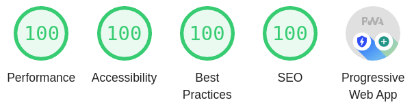

# Socket.IO v3 Issue

## Features

- Development server with hot reload
- Lazy Loading
- Progressive Web App
- Service Worker
- Server Side Rendering
- Sass for styling
- Perfect Lighthouse score

  

## Commands

- Setup project: `yarn`
- Start development server: `yarn dev`
- Start normal web server: `yarn app`
- Start PWA web server: `yarn pwa`
- Start Node.Js with server side rendering: `yarn ssr`
